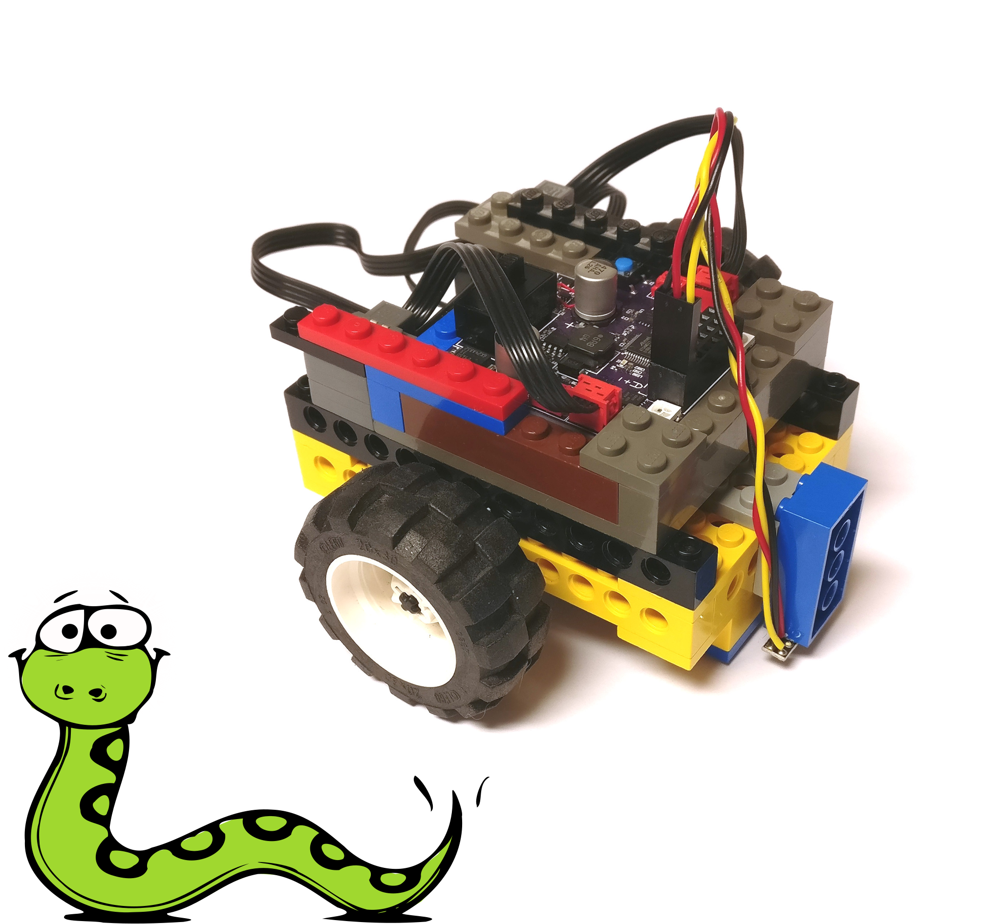
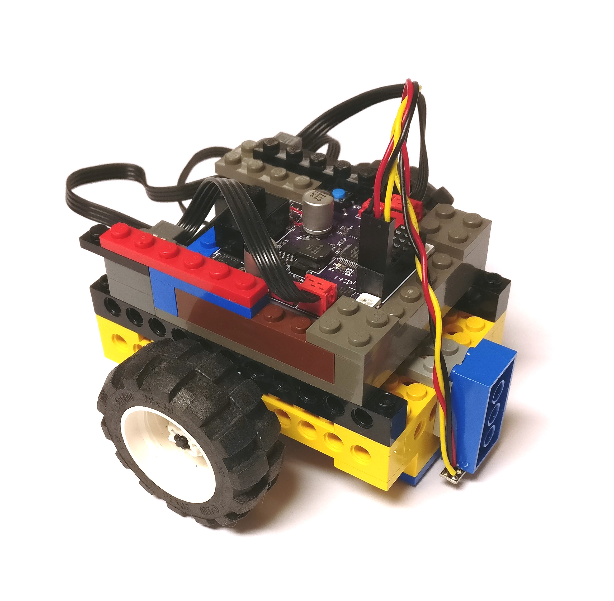
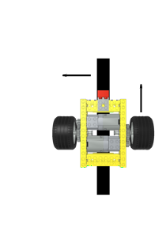
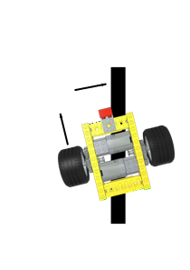

= Snek Lesson #2: The Line Bug
Keith Packard <keithp@keithp.com>; Michael Ward <michaelward@sprintmail.com>
:version: 0.0
:title-logo-image: 
:revnumber: v{version}
:revdate: 1 Jan 1970
:experimental:
:icons:
:icontype: svg
:copyright: Keith Packard 2020
:doctype: article
:numbered:
:stylesheet: snek.css
:linkcss:
:toc:
:pdf-stylesdir: .
:pdf-fontsdir: ../../fonts
:source-highlighter: coderay
:media: prepress

ifndef::backend-pdf[]
[#logo]
[link=https://keithp.com/snek]
image::snek.svg[Snek]
endif::[]

[colophon]
[%nonfacing]
== License

Copyright © 2020 {authors}

This document is released under the terms of the link:https://www.gnu.org/licenses/gpl-3.0.en.html[GNU General Public License, Version 3 or later]

[dedication]
[%nonfacing]
== Acknowledgments

Thanks to Michael Ward for writing this up.

[verse]
{author}
{email}
https://keithp.com

== The Line Bug

This lesson contains instructions for building and programming a “Line
Bug”, a little mobile robot (bug) to follow a line. There may already
be a bug built and ready for you to program, but if not, they are not
hard to construct. Instructions below show you how to build one that
looks like this:

Important features:

 * Two motors to move the bug, one for each wheel.
 * One IR light sensor: glued to the blue brick
 * Skid plates on the bottom mean the surface must be flat!

There are various strategies for solving the challenge of getting the
line bug to follow the line (some of which you can pursue all the way
to advanced control projects through independent study).  However all
of them involve sensing the line (a good place to start) and
controlling the wheels to keep the bug (and more importantly, the
sensors) following the line:

 * How will you detect the line? (Try it!)
 * How will you move the bug based on this? (Start small and keep testing!)

=== Sensing the Line

To start you’ll need a surface with a line, a light sensor, and some
code to read and print light sensor values. You might use a white
surface with a black line, or a black surface with a white line. The
line needs to be thick enough to detect the line as the bug moves: 3/4
of an inch or more. Whatever your intended track, begin by testing the
light sensor using something like this (use <Ctrl>C to stop):

	while True:
		print(read(A1))
		time.sleep(1)

Consider:

 * Sensor values will depend on light reflected from the surfaces
   (which depends on how much light there is in the area). To make
   your program less sensitive to this, the IR light sensor has its
   own built-in IR light source.

 * Sensor values will vary. Read a number of different values for the
   line and use a typical or average value. Do the same for the
   background. Use these to figure out a threshold half way between
   the two. [Extensions: Use a well named variable for the threshold,
   use snek to compute average values and threshold, automate your bug
   to learn these values …]

 * Using functions and variables to organize and document the
   code. One strategy is to name the condition and then return True or
   False to indicate the condition, such as OnLine() or OverTape().

You might get values like these:

.Light Sensor Sample Values
[options="header",width="50%",align="center",halign="center"]
|====
|White Board	|Black Tape
|  0.05225885  | 0.8752137
|  0.05177045  | 0.8742369
|  0.05299145  | 0.8739927
|  0.05299145  | 0.8727717
|  0.05201465  | 0.8737485
|  0.05225885  | 0.8735043
|====

Values for the white board are around 0.05, values for the black tape
are near 0.87 A reasonable threshold would be about halfway between, or
0.45. Code to detect the difference could be as simple as this:

[source,python,subs="verbatim,quotes"]
----
if read(A1) < 0.45:
    print(“board”)
else:
    print(“tape”)
----

On the other hand, for code that others (including your future self)
can more easily understand, test, and tweak, create names for values
at the beginning of the program:

[source,python,subs="verbatim,quotes"]
----
LightSensor = A1
TapeThreshold = 0.45
----

Then, define a well-named function to use them:

[source,python,subs="verbatim,quotes"]
----
def OnTape():
    return(read(LightSensor) > TapeThreshold) 
----

and use it in later code like this:

[source,python,subs="verbatim,quotes"]
----
if OnTape():
    print(“tape”)
else:
    print(“board”)
----

=== Moving The Bug

How can we keep the bug moving along the line? What if the line is
really wide? Let’s take this to the extreme: half a rectangle that’s
white and the other half black. This makes it clear that what is
really needed is to follow the edge between the two.

So, how to follow the edge? This is easier if the edge is near the
sensor (and we allow the bug to turn completely around). Just turn the
bug until it finds the line. Then what? This is where you either try
it yourself, play around and figure it out, or I help you think about
it here. For those of you that want to figure it out yourself, when
you find the line just stop the bug and take a look and think about
it. Or brainstorm with someone. Your test code might look something
like this:

[source,python,subs="verbatim,quotes"]
----
talkto(M1)
setright()
setpower(1)
on()
while not OnTape():
    pass
off() 
----

If you want to proceed this way, I suggest that you make it easier to
experiment by organizing with variables and functions as in the last
section. Use two functions, one to turn the bug left, the other to
turn it right, and get them to work so that each turn moves the bug
toward the sensor:

[source,python,subs="verbatim,quotes"]
----
RightWheel = M1
LeftWheel = M3
Speed = 1

def StartLeftTurn():
    talkto(LeftWheel)
    off()
    talkto(RightWheel)
    setright()
    setpower(Speed)
    on()

def StartRightTurn():
    talkto(RightWheel)
    off()
    talkto(LeftWheel)
    setleft()
    setpower(Speed)
    on()
----

.Left Turn

To keep things simple, turn only one wheel at a time. Also notice the
exceedingly specific function names. They remind us that they only
start a turn and do not complete one. They leave the bug
turning. After you get each function working (turn the car upside down
to test), control the bug with them at the command line. To stop a
turn, just type `off()`. Experiment with a sequence like this that uses
the sensor to both start the turn, and complete it:

[source,python,subs="verbatim,quotes"]
----
while OnTape():
    StartLeftTurn()
else:
    off()
----

Give them a try. As long as both turns move the bug in the sensor
direction, eventually you’ll come across the working strategy of
alternating the turns *and* alternating the condition:

[source,python,subs="verbatim,quotes"]
----
while OnTape():
    StartLeftTurn()
else:
    off()
while not OnTape():
    StartRightTurn()
else:
    off()
----

.Right Turn

The first stage solution can be had by doing this over and over again
(and since the turn functions turn off the other motor we leave that
part out):

[source,python,subs="verbatim,quotes"]
----
def LineBug():
    while True:
	while OnTape():
	    StartLeftTurn()

	while not OnTape():
	    StartRightTurn()
----

Once you have defined this function, you can test it at the command
line by entering: `LineBug()`. Use kbd:[Ctrl+C] to break out of the
loop. When you are ready to test it without the USB connection, add
the call to`LineBug()` as the last line of the program, with a blank
line above it and at the leftmost column. Then pick up the line bug
(so it does not run off the edge of the desk and crash apart) and `Put`
the program to write it to the snekboard. If all goes well, the
program will start rotating a wheel, disconnect the USB cable, and
test the it on your course.

=== Testing and Debugging

In addition to making code more understandable, using functions and
variables (as demonstrated in the last couple of sections) helps us
test, tune, and debug1 our code as well. One of the biggest advantages
is that we end up testing smaller segments of code that have less to
do and make it easier to find where and what is going
unexpectedly. Also, by using variables, we can tweak things without
having to change the code we just got working! You can just change
Speed and then rerun LineBug() to see what happens.

Using Well Named Variables and Functions:

 * Makes the code more understandable.
 * Makes the code easier to test and debug.
 * Makes it easier to try ideas.
 * Builds a language for communicating your ideas.

Nevertheless, even using these strategies, things often still go
wrong. The first step of debugging is to think about what the code is
doing in detail (see Optimizing Code). If that doesn’t do the trick,
print things that tell you what the code is doing (so you can check it
against what you think it should be doing)! The basic idea is to print
out what the code is doing at strategic points (often printing out key
values as well):

[source,python,subs="verbatim,quotes"]
----
def LineBug():
    while True:
	print(“Turn left while on tape.”)
	while OnTape():
	    StartLeftTurn()

	print(“Turn right while off tape.”)
	while not OnTape():
	    StartRightTurn()
----

Until you start writing code based on ideas not easily visible from
the code itself, you are better off using meaningful variable and
function names than writing lots of comments. Since comments are not
executed, tested, and subsequently corrected, they often are
wrong. Nevertheless, we’ll use a few comments (once you get your line
bug working) and keep them around for both description and future
debugging:

[source,python,subs="verbatim,quotes"]
----
def LineBug():
    while True:
	#print(“Turn left while on tape.”)
	while OnTape():
	    StartLeftTurn()

	#print(“Turn right while off tape.”)
	while not OnTape():
	    StartRightTurn()
----

ifdef::backend-pdf[<<<]
== Building The Line Bug

Follow the next few pages to complete the construction of your line
bug. For the wheels, you can use any that will fit on the axles and
not rub on the 8-tooth gears.

include::steps.adoc[]

== Wiring The Line Bug

Attach the Snekboard to the top of the line bug.

Connect the motor driving the left wheel to M3 and the motor driving
the right wheel to M1. If you connect things differently, you'll need
to adjust the values in the program.

Connect the light sensor to A1. Make sure you insert the connectors
the right way, with the black wire towards the center of the snekboard
and the yellow or white wire towards the edge. Use hot glue to attach
the light sensor to a 4x2 brick and then attach the light sensor to
the front of the line-bug using the Light Gray 2 x 2 Bracket.

[appendix]
== The Line Bug Program

[source,python,subs="verbatim,quotes"]
----
include::line-bug.py[]
----

image::snek.svg[align="center"]
