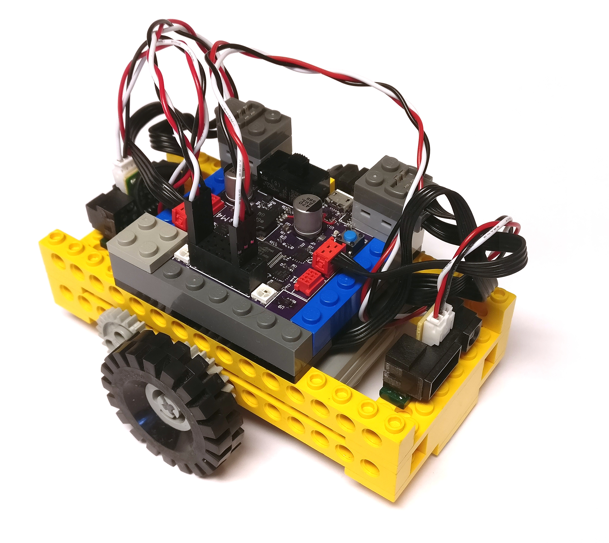

= Lesson #3: The Bumper Car
Keith Packard <keithp@keithp.com>; Michael Ward <michaelward@sprintmail.com>
:version: 0.0
:title-logo-image: 
:revnumber: v{version}
:revdate: 1 Jan 1970
:experimental:
:icons:
:icontype: svg
:copyright: Keith Packard 2020
:doctype: article
:numbered:
:stylesheet: snek.css
:linkcss:
:toc:
:pdf-stylesdir: ../..
:pdf-fontsdir: ../../fonts
:source-highlighter: coderay
:media: prepress

ifndef::backend-pdf[]
[#logo]
[link=https://keithp.com/snek]
image::snek.svg[Snek]
endif::[]

[colophon]
[%nonfacing]
== License

Copyright © 2020 {authors}

This document is released under the terms of the link:https://www.gnu.org/licenses/gpl-3.0.en.html[GNU General Public License, Version 3 or later]

[dedication]
[%nonfacing]
== Acknowledgments

Thanks to Michael Ward for helping create this little robot.

[verse]
{author}
{email}
https://keithp.com

== The Bumper Car

This lesson contains instructions for building and programming a
“Bumper Car”, a little mobile robot that navigates around the room
while trying to avoid bumping into things. This lesson builds on the
“Line Bug” lesson, so it might be a good idea to explore that one
before getting started here.

ifdef::backend-pdf[<<<]
== Building The Bumper Car

Follow the next few pages to complete the construction of your bumper
car.  For the wheels, you can use any that will fit on the axles and
not rub on the 8-tooth gears.

Important features:

 * Two motors to move the bug, one for each wheel.
 * Two distance sensors. These look for objects and tell you how far
   away they are.
 * Skid plates on the bottom mean the surface must be flat!

=== Sensing Obstacles

Test the distance sensors using something like this (use <Ctrl>C to stop):

	while True:
		print(read(A1))
		time.sleep(1)

Wave your hand or another object in front of the sensor and see what
kinds of values you get. You should get larger values when something
is close to the sensor and smaller values when everything is further
away. Experiment with how far off to the side the sensor can detect
objects.

=== A Detector Function

Now that you've got some idea of what values represent an obstacle,
let's write a function that reports whether there's something in our
way.

[source,subs="verbatim,quotes"]
----
	threshold = 0.5

	def obstacle(sensor):
		return read(sensor) > threshold
----

This function takes a “parameter”, `sensor`, and uses that to read
from. We can pass either A1 or A8 to obstacle and it will let us know
if there's something in the direction of that sensor.

=== Driving Blind

Let's write up a couple of functions to set the robot moving forwards
or backwards.

[source,subs="verbatim,quotes"]
----

	# Start moving forward
	def forward():
		talkto(M1)
		setleft()
		on()
		talkto(M3)
		setright()
		on()

	# Start moving backward
	def backward():
		talkto(M1)
		setright()
		on()
		talkto(M3)
		setleft()
		on()

	# Turn motors on to spin around
	def spin_left():
		talkto(M1)
		setleft()
		on()
		talkto(M3)
		setleft()
		on()

	# Turn motors on to spin the other way
	def spin_right():
		talkto(M1)
		setright()
		on()
		talkto(M3)
		setright()
		on()

	# Wait a random time between 1 and 3 seconds
	def sleep_random():
		time.sleep(1 + random.randrange(20) / 10)

	# Our main program
	def bumper_car():
		while True:

			# Move forward until we see something
			forward()
			while not obstacle(A1):
				pass

			# Back up a bit
			backward()
			time.sleep(1)

			# Spin around
			spin_left()
			sleep_random()

			# Move backward unil we see something
			backward()
			while not obstacle(A8):
				pass

			# Go forward a bi
			forward()
			time.sleep(1)

			# Spin around
			spin_right()
			sleep_random()

	bumper_car()
----

include::steps.adoc[]

=== Wiring The Bumper Car

Connect the motor driving the left wheel to M3 and the motor driving
the right wheel to M1. If you connect things differently, you'll need
to adjust the values in the program.

Connect one distance sensor to A1 and the other to A8. Make sure you
insert the connectors the right way, with the black wire towards the
center of the snekboard and the yellow or white wire towards the edge.
Attach the distance sensors to either end of the bumper car using the
1 x 4 tiles.
