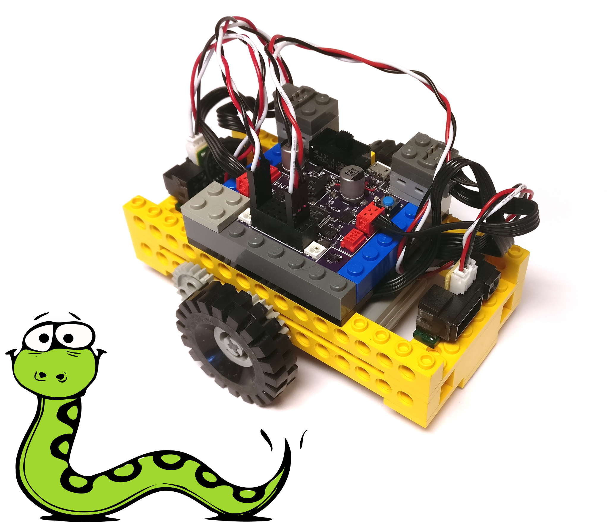
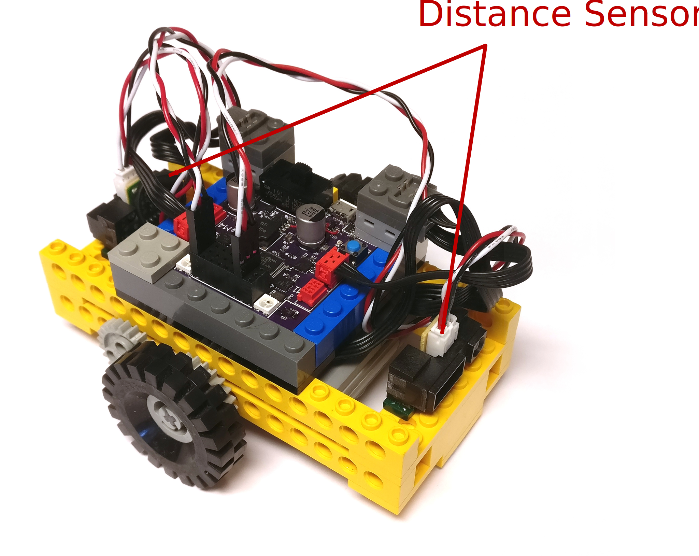

= Snek Lesson #3: The Bumper Car
Keith Packard <keithp@keithp.com>; Michael Ward <michaelward@sprintmail.com>
:version: 0.0
:title-logo-image: 
:revnumber: v{version}
:revdate: 1 Jan 1970
:experimental:
:icons:
:icontype: svg
:copyright: Keith Packard 2020
:doctype: article
:numbered:
:stylesheet: snek.css
:linkcss:
:toc:
:pdf-stylesdir: ../..
:pdf-fontsdir: ../../fonts
:source-highlighter: coderay
:media: prepress

ifndef::backend-pdf[]
[#logo]
[link=https://sneklang.org]
image::snek.svg[Snek]
endif::[]

[colophon]
[%nonfacing]
== License

Copyright © 2020 {authors}

This document is released under the terms of the link:https://www.gnu.org/licenses/gpl-3.0.en.html[GNU General Public License, Version 3 or later]

[dedication]
[%nonfacing]
== Acknowledgments

Thanks to Michael Ward for helping create this little robot.

[verse]
{author}
{email}
https://keithp.com

== The Bumper Car

This lesson contains instructions for building and programming a
“Bumper Car”, a little mobile robot that navigates around the room
while trying to avoid bumping into things. This lesson builds on the
“Line Bug” lesson, so it might be a good idea to explore that one
before getting started here.

The bumper car is much like the line bug, in that it moves a car based
on sensor input. However, it replaces the light sensor and LED with
two analog IR distance sensors, and replaces attraction with
avoidance.

.Bumper Car

Important features:

 * Two motors to move the bug, one for each wheel.
 * Two distance sensors. These look for objects and tell you how far
   away they are.
 * Skid plates on the bottom mean the surface must be flat!

The basic ideas are:

 * The car should move in one direction (the direction of one of the
   sensors) until something gets too close.

 * When something gets too close, the car should change directions (to
   the direction of the the other sensor).

 * Now apply these rules over and over.

=== Planning the Bumper Car Program

It is always a good idea to identify (and write out) what it is you
want a program to do. This helps us identify and think about key
actions and behaviors. Some of the components that result from this
here are:

 * Moving the car in one direction.  (Commands to set the motors for
   direction 1.)

 * Changing the direction. (Commands to set the motors for the other
   direction, direction 2.)

 * Determining when something gets too close. This requires some
   refinement! What if something gets close behind the car? Should the
   car change direction and run into it? Of course not. Therefore, the
   refinement is: Determining when something gets too close in the
   direction of motion.

=== Moving in One Direction

Once we enter interactive commands to try running the motors (turning
them on and off, setting direction and power) we figure out that
rotating them in opposite directions moves in the direction of a
sensor. We can write two functions to move in opposite directions. For
now, lets do this at ½ speed:

[source,python,subs="verbatim,quotes"]
----
def MoveOneDir():
    talkto(M2)
    setpower(0.5)
    setleft()
    on()
    talkto(M3)
    setpower(0.5)
    setright()
    on()

def MoveOtherDir():
    talkto(M2)
    setpower(0.5)
    setright()
    on()
    talkto(M3)
    setpower(0.5)
    setleft()
    on()
----

The difference between these two functions is that `MoveOneDir` calls
`setleft` for `M2` and `setright` for `M3` while

=== The Distance Sensor

We can test the sensor with the interpreter, using our hand for
distance:

[subs="verbatim,quotes"]
----
> *while True:*
+   *print(read(A8))*
+   *time.sleep(1)*
+ 
0.162149
0.1758242
0.197558
0.1965812
0.1726496
0.7111111
0.7103785
0.7115995
0.4957265
0.1880342
0.1777778
kbd:[Ctrl+C]
----

=== Wait Until We're Close

We figure out that A8 is sensing in this direction, and 0.4 works as a
threshold between close and far. Let's write a couple of functions
that wait until we're closer than that

[source,python,subs="verbatim,quotes"]
----
def WaitUntilCloseOneDir():
    while read(A8) < 0.4:
	pass

def WaitUntilCloseOtherDir():
    while read(A7) < 0.4:
	pass
----

The rest of the program might then
look like this:

[source,python,subs="verbatim,quotes"]
----

def BumperCar():
    while True:
	MoveOneDir()
	WaitUntilCloseOneDir()
	MoveOtherDir()
	WaitUntilCloseOtherDir()

BumperCar()
----

=== Turning Around ===

Now that we have the bumper car avoiding objects, let's give it the
ability to explore its environment a bit by having it turn, instead of
always moving in a straight line. To keep from hitting things while we
do this, we'll spin in place.

To make our robot less predictable, let's have it spin a random
amount. Random numbers are like the roll of a die; you can't predict
the value. Snek can generate random numbers using the
`random.randrange` function. `random.randrange` takes one value, and
will generate a random number from zero to one less than this value.
So, if you want a random number from the set { 0, 1, 2, 3, 4, 5 },
you'd use `random.randrange(6)`. We can do arithmetic on the number to
adjust the range further.

Let's explore that:

[subs="verbatim,quotes"]
----
> *random.randrange(6)*
3
> *random.randrange(6)*
1
> *for i in range(5):*
+     *print(random.randrange(6))*
+ 
5
1
4
0
3
> *for i in range(5):*
+     *print(random.randrange(6) + 1)*
+ 
6
5
1
1
5
> 
----

Next, we can write a function that waits for a random amount of time,
say between 1 and 6 seconds:

[source,python,subs="verbatim,quotes"]
----
def WaitRandom():
    wait = random.randrange(6) + 1
    time.sleep(wait)
----

Let's figure out how to get the bumper car to spin. To go straight, we
use `setleft` with one motor while we use `setright` with the
other. Let's make it spin by having the wheels turn in opposite
directions by setting both motors with either `setleft` or `setright`:

[source,python,subs="verbatim,quotes"]
----
def Spin():
    talkto(M2)
    setpower(0.5)
    setright()
    on()
    talkto(M3)
    setpower(0.5)
    setright()
    on()
----

Now we can hook those together to spin for a random amount of time:

[source,python,subs="verbatim,quotes"]
----
def SpinRandom():
    Spin()
    WaitRandom()
----

Add some code to `BumperCar` to back up from the obstacle a bit, spin
randomly and then go straight again:

[source,python,subs="verbatim,quotes"]
----
def BumperCar():
    while True:

	# Back up a bit and spin around
	MoveOneDir()
	time.sleep(1)
	SpinRandom()

	MoveOneDir()
	WaitUntilCloseOneDir()

	# Back up a bit and spin around
	MoveOtherDir()
	time.sleep(1)
	SpinRandom()

	MoveOtherDir()
	WaitUntilCloseOtherDir()
----

Here are some further ideas on how you might extend this program:

 * Wait for closeness before starting the bumper car.

 * Stop all motion when things get close on both sensors.

 * Adjusting the speed of motors.

 * Adjusting the closeness before changing.

 * Try changing directions with a fixed or random turn.

ifdef::backend-pdf[<<<]
== Building The Bumper Car

Follow the next few pages to complete the construction of your bumper
car.  For the wheels, you can use any that will fit on the axles and
not rub on the 8-tooth gears.

include::steps.adoc[]

=== Wiring The Bumper Car

Connect the motor driving the left wheel to M3 and the motor driving
the right wheel to M1. If you connect things differently, you'll need
to adjust the values in the program.

Connect one distance sensor to A1 and the other to A8. Make sure you
insert the connectors the right way, with the black wire towards the
center of the snekboard and the yellow or white wire towards the edge.
Hot glue the distance sensors to 1x4 tiles and attach them at either
end of the bumper car.

image::snek.svg[align="center"]
