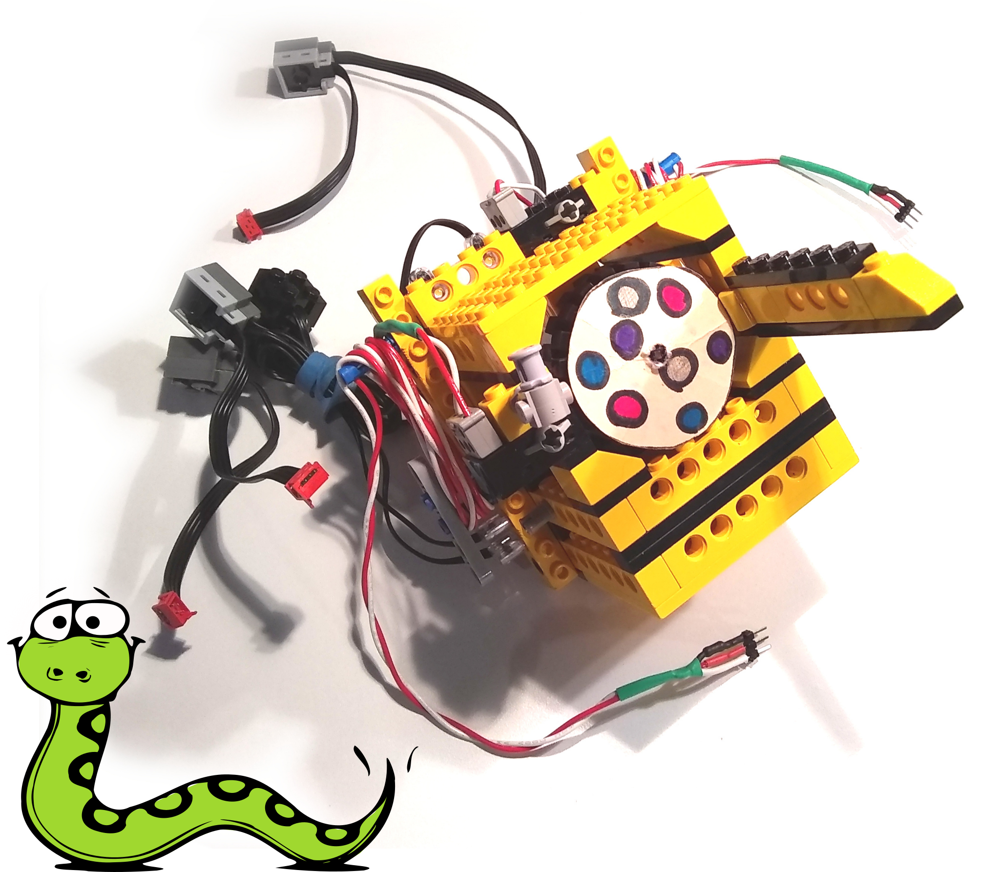
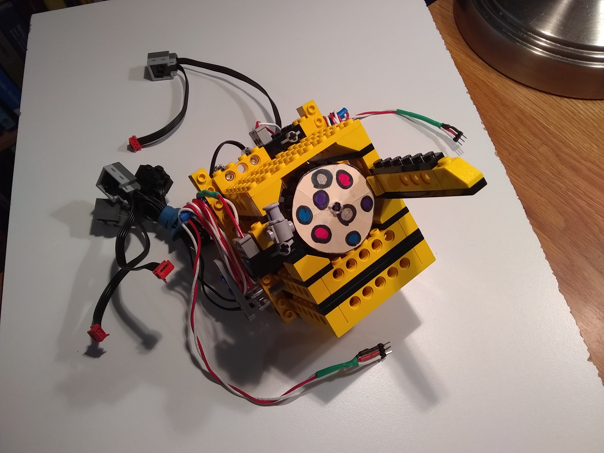

= Snek Lesson #4: The Washing Machine
Keith Packard <keithp@keithp.com>; Michael Ward <michaelward@sprintmail.com>
:version: 0.0
:title-logo-image: 
:revnumber: v{version}
:revdate: 1 Jan 1970
:experimental:
:icons:
:icontype: svg
:copyright: Keith Packard 2020
:doctype: article
:numbered:
:stylesheet: snek.css
:linkcss:
:toc:
:pdf-themesdir: ../..
:pdf-fontsdir: ../../fonts
:source-highlighter: coderay
:media: prepress

ifndef::backend-pdf[]
[#logo]
[link=https://sneklang.org]
image::snek.svg[Snek]
endif::[]

[colophon]
[%nonfacing]
== License

Copyright © 2020 {authors}

This document is released under the terms of the link:https://www.gnu.org/licenses/gpl-3.0.en.html[GNU General Public License, Version 3 or later]

[dedication]
[%nonfacing]
== Acknowledgments

Thanks to Michael Ward for helping design this lesson.

[verse]
{author}
{email}
https://keithp.com

== The Washing Machine

Both the line bug and bumper car only had to react to the
environment. They did not have to remember or follow a sequence of
actions (beyond controlling the motor). This project, requires
stepping through a prescribed set of states to act like a simple
washing machine.

.Washing Machine

Important features:

 * One motor to rotate the washer drum (the blobby disc of clothes 😉.

 * Two touch sensors: one for control and one for the door.  The
   red=power and white=signal wires mean the switch will be high when
   pressed and pulldown() should be used before reading it.

 * Two LEDs to indicate the machine state.

The goals of this lesson are to build a model which does the
following:

 * Before starting, the door needs to be closed

 * The control button starts a wash.

 * To wash: rock back and forth for a while

 * To spin: rotate fast

 * Use the lights to indicate what's going on

Unlike the Line Bug and Bumper Car, which respond immediately to their
environment this model runs through a sequence of fairly complicated
operations.

Rather than try to write the program in complete detail on the first
attempt, we’ll start by writing pieces of the program and then put
them together at the end.

=== Washing Clothes

If you've ever watched a washing machine at work, you'll see it slosh
the clothes back and forth though sudsy water.  We'll simulate that by
slowly rocking the “drum” several times, alternating first in one
direction and then the other.

To go in one direction and then the other means using `setright` and
`setleft` before turning the motor on for a short time. We'll use a
lower power setting so that the drum doesn't appear to go too
fast. That might look something like this:

[source,subs="verbatim,quotes"]
----
def Slosh():
    talkto(M1)
    setpower(0.5)
    setleft()
    onfor(1)
    setright()
    onfor(1)
----

.The For Loop
****

The `for` loop asks snek to count, and then do something each time. It
will count using numbers by using the `range` function. That tells
snek how far to count. Snek starts counting at 0 and stops counting
just before it reaches the value given to `range`. If you give range
the value 5, then Snek will count 0, 1, 2, 3, and finally 4. This is
five different numbers, so range(5) means to count five times starting
at 0.

[source,subs="verbatim,quotes"]
----
	> *for i in range(5):*
	+	*print(i)*
	+
	0
	1
	2
	3
	4
	>
----
****

We need to `Slosh` several times in a row. We'll do that with a `for`
loop. Let's write a Wash function that runs the `Slosh` function ten
times:

[source,subs="verbatim,quotes"]
----
def Wash():
    for i in range(10):
        Slosh()
----

You can adjust the number of times it sloshes, the speed of sloshing
and the length of time it sloshes in each direction by changing the
numbers in these two functions.

=== Spinning To Wring Out the Water

After washing the clothes, the washing machine needs to get as much of
the water out as possible. Otherwise, your clothes would take a lot
longer to dry. It does this by using centrifugal force. By spinning
the drum quickly, much of the water in the clothes is drawn out
through holes in the drum and drained away.

We'll simulate that by running our motor at high speed for a
while like this:

[source,subs="verbatim,quotes"]
----
def Spin():
    talkto(M1)
    setpower(1)
    setright()
    onfor(5)
----

This time, we make the motor go as fast as it can for five
seconds. You can make it go longer, switch directions or whatever else
you like by changing this function.

=== Waiting For Switches

We want our washing machine to wait until the door is closed and the
start button is pressed before washing the clothes. For each switch,
we'll want to keep checking to see if it has been pressed using a
`while` loop. Recalling what we learned in lesson 1 about switches, we
need to use the `pulldown` function so that our on/off switches work
correctly. Putting those together, we might create a WaitSwitch
function like this:

[source,subs="verbatim,quotes"]
----
def WaitSwitch(switch):
    pulldown(switch)
    while not read(switch):
        pass
----

=== Putting The Program Together

Now that we've got most of the pieces of our washing machine ready, we
can assemble them together by writing a main function, `WashCycle`
that does the steps in the order we defined above:

 * Door closed
 * Start button pushed
 * Wash
 * Spin
 * Done

That program might look like this:

[source,subs="verbatim,quotes"]
----
def WashCycle():

    # Wait for door to be closed
    WaitSwitch(A1)

    # Wait for start button
    WaitSwitch(A8)

    # Wash the clothes
    Wash()

    # Spin them to wring out some water
    Spin()
   
    # All done!
----

=== Indicator Lights

We've stuck a couple of lights on our washing machine to tell the user
what is happening. Let's add a couple of functions to turn them on
and off:

[source,subs="verbatim,quotes"]
----
def LightOn(light):
    talkto(light)
    setpower(1)
    on()

def LightOff(light):
    talkto(light)
    off()
----

We can use these wherever we like. One option is to turn one light on
during the wash cycle and the other during the spin cycle. Another
idea is to turn one light on when the door is closed, the other while
the cycle is going, then turn the first off when the door is opened
again.

[appendix]
== Building The Washing Machine

Follow the next few pages to complete the construction of your washing
machine.

include::steps.adoc[]

=== Wiring The Washing Machine

Here's one way to wire up the washing machine. If you wire it up
differently, you'll need to adjust for that when programming the
robot.

 1. Connect the motor driving the drum to M1.

 2. Connect the door switch A1 and the switch on top to A8. Make sure
    you insert the connectors the right way, with the black wire
    towards the center of the snekboard and the yellow or white wire
    towards the edge.

 3. Connect the lights to M2 and M3.

image::snek.svg[align="center"]
